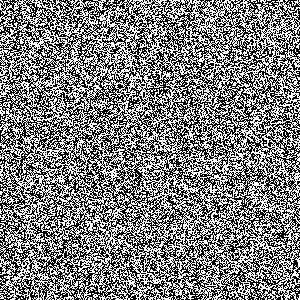
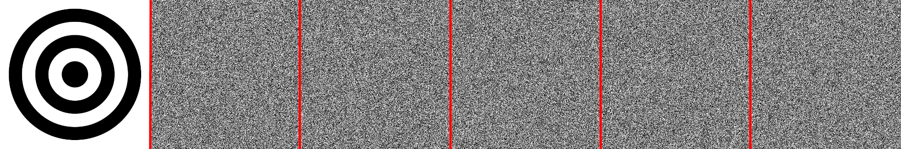

# Cellular Automata Encryption

An encryption method using Cellular Automata (CA) following the work of Wuensche in [^1]. This is constructed here for the purposes of better understanding Wuensche's proposed method of CA based encryption.

**Note:** This repo is under development as experiments with CA encryption continue. As such this documentation is currently an outline of thought process rather than detailed program documentation. The code itself is extensively commented and full documentation will follow after experimentation has finished and the code is in a more constant state.

**Note:** As the approach is currently under experimentation, and as such the code is in a state of flux, some routines are not optimised for reduction of computational cost.

We start by defining some concepts integral to Wuensche's CA encryption method [^1]. Using these definitions we implement the algorithm in python3 and encrypt some sample images. These initial tests are used for a very naive initial investigation into the practicality of the scheme.


## Some Initial Definitions/Methods

Before considering the CA encryption method we assume a degree of familiarity with CAs (see for example [^2], [^3] or [^4]). With this in mind we only consider elementary cellular automata, i.e. 1 dimensional CA with a rule-set dependant only on the cells nearest neighbours. Let the size of this neighbourhood be `k` where `k` is odd such that to calculate the ith cell at the next time step we consider the cells [i-((k-1)/2),i+((k-1)/2)].

Then consider a CA rule-set `R : b^k to b` for `b in {0,1}`. Note `R` need not be injective or surjective, and therefore need not have an inverse. However, we can construct a rule-set such that there exists an algorithm that can reverse a CA step following [^1].

Consider the set of unique permutations of `k-1` bits and let `p` be some element of this set. We then construct a pair of rules for the CA by taking some `p` and appending a 0 (to the right), designating the output of the rule for these `k` bits to be `b_0`. We do this again for the same `p` but this time appending a 1 resulting in `b_1`. We say that this pair of `k-1` bits is distinct if `b_0 /= b_1`. This is done for all permutations of `k-1` bits. The sum of distinct pairs divided by the number of permutations gives `Z_left`, where a similar approach (but with appending on the left) gives `Z_right` [^1].

Note the left and right in the previous paragraph may seem to be the wrong way around, but the above naming convention makes more sense once a backwards CA step has been ran.


### Running a CA Backwards

Start by generating a CA rule-set `R` such that `Z_left=1`, furthermore we require `Z_right>=0.5` (following [^1]).

Assume we know all `i` cells in a 1D periodic array indexed from `1` to `N` at a current time `j`. We wish to find valid cells at time `j-1` that under application of the CA rule-set would evolve to the known state at time `j`. We do this by first guessing the first `k-1` bits in the neighbourhood of cell `1`. As the pair of possible sets of `k` neighbourhood bits are distinct we can use the `k-1` bits we have guessed along with the resultant bit (at time `j`) to find the final `k`th bit in the neighbourhood (at time `j-1`)

We then move along the cells from left to right, ending on cell `N`. At this point we have an array of cells at time `j-1` that is of length `N+k-1`. The `(k-1)/2` elements on either end of this new array are the 'wraparound values' that result from the periodicity of the array. If the periodic conditions are met the guessed bits are sufficient, if not we guess again and repeat until we find a valid backwards step. This approach is as described in more detail in [^1].

Note, it is possible that we cannot find a backwards step. However, this is unlikely to happen given a large enough state space. Also note we find a backwards step, but this needn't be the only possible previous state that would evolve with `R` into the state at time `j`.


#### Example

Let `k=3` and `N=5`. Also let the array of cells at time `j` be given by
```
| 1 | 0 | 0 | 1 | 1 |
```
Then we guess our first two bits (labelled `G_N` and `G_1`) to be `0` and `1` where we wish to calculate the bit labelled `C_2`:
```
 G_N=0 | G_1=1 | C_2 |
       | 1     | 0   | 0   | 1   | 1   |
```
As the pairs of rules for `010` and `011` are distinct (i.e. one leads to a `1` and the other a `0`) we can find `C_2` from the two guessed values and the result at time `j` in index `1` of `1`. We then know the two `G` values and `C_2`, where we use `G_1` and `C_2` and the result of `0` at time `j` to find `C_3`
```
 G_N=0 | G_1=1 | C_2 | C_3 |
       | 1     | 0   | 0   | 1   | 1   |
```
We continue in this way to find all `C` values:
```
 G_N=0 | G_1=1 | C_2 | C_3 | C_4 | C_5 | C_6
       | 1     | 0   | 0   | 1   | 1   |
```
Due to the periodicity of the array it must be the case that `G_N=C_5` and `G_1=C_6`. If this is the case then the previous step we have found is valid (though it is not necessarily the only valid 'backwards step'). I.e. valid cells at time `j-1` are `|G_1|C_2|C_3|C_4|C_5|` and stepping forwards with the given ruleset will recover our initial array `|1|0|0|1|1|`.


## CA Only Symmetric Key Encryption

Let us assume Alice has some binary data represented as a 1D array of cells she wishes to encrypt, `D`. Alice wishes to encrypt this data then send it to Bob.

First Alice decides on some odd `k>1` and generates a random CA rule list `R` that fulfils `Z_left=1` and `Z_right>=0.5`. Alice also decides on the number of CA steps to use, `T>=1`. This rule list along with `k` and `T` is the symmetric key which must be secretly shared with Bob.

Alice then steps backwards from `D` by `T` steps using `R`. This data is the encrypted data that is sent to Bob. Bob can then decrypt by taking `T` forward steps using `R` (which is a much cheaper operation).


### Example (binary image)

Let `T=5` and `k=7` and randomly generate a rule set with `Z_left=1` and `Z_right>=0.5`. We then take our initial data (i.e. cells at time `j`) from a simple image, where each pixel of the image is either `0` (white) or `1` (black) which we refer to as a 'binary image'. Encrypting by evolving the CA backwards in time by 5 steps gives the results below, where each CA backwards step is shown (going from left to right with each step separated by a red line):


It is clear the encryption is 'not enough' after these 5 steps to completely obscure all the information in input. Of particular note are the low entropy areas at the top and bottom of the image (where there were large blocks of `0`s) and the central point (where a similar pattern repeated over many lines).

One way to get around this is by stepping back by a much larger number of steps. However, the cost involved in the encryption stepping backwards is not necessarily trivial, so doing this is far from ideal.


### Example (greyscale image)

To examine the problem in a more realistic scenario we turn to a greyscale image (again using an image for ease of visualisation). This is done by converting the image into a 1D array by expressing each pixel as 8 bits (i.e. integers in [0,255]). We then run this image through a randomly generated CA with parameters as in the previous section (`T=5`, `k=7`, `Z_left=1` and `Z_right>=0.5`). We also utilise the same starting image as in the previous subsection, just not converted to its 'binary image' form). This results in the below 'backwards evolution' over 5 time steps


where the 'backwards evolution' runs from the initial image on the left and evolves backwards to the right (with each step separated by a red vertical line).

We see from this experiment that the 'shadow' of the original image is even more obvious than when we were using a binary image. This is a result of the repeated patterns e.g. the whitespace at the top and bottom and the repeated pattern across the centre of the circles. It is these regions which result in a repeated pattern when ran through a CA, and they are larger when there is 8 bits per pixel.

One way to avoid this would be to add some form of noise to the original image (via a XOR operation). The structure of this noise will (hopefully) be lost in the backwards step in the CA further obfuscating the original message. But at this moment this approach is far from mathematically justified.


### Example (less uniform greyscale image)

We now turn to the exact same approach as above, but with less uniform initial data, in this case a picture of a clown. We see the backwards evolution over `T=5` steps with `k=7` below.


It seems from a cursory look that the initial image is obfuscated by the 5 backwards steps, at least much more than in the case of the circle image.


## Adding a XOR to Increase Entropy

One idea to increase the entropy is to XOR our input data with a pseudo random bit string. One method would be for Alice to publicly distribute this random bit string. Bob could then take the string and XOR it with the result of performing the CA decryption steps to recover the encrypted message.

As this random bit string is public it can be varied with each message in order to further obfuscate the key.

### Method

Instead of distributing a large bit string (of the same size as the encrypted data) we distribute a random seed. This is coupled with (for now) the 'Even Quicker and Dirtier Generator' for random numbers from [^5] (p275-276). To generate the a random number `R` we need an initial seed `S`, then for every random number we perform [^5]

```
R = S * 1664525 + 1013904223 (mod 2^32)
S = R
```

This allows both Alice and Bob, who have agreed on the 'Even Quicker and Dirtier Generator' (EQaDG) [^5] (p275-276) to cheaply generate the same pseudo random bit string without the need to send large amounts of data.

### Example of XORing

If we take the same binary circles image input as earlier and XOR with a bit string created with the random seed `3574541233091423` and EQaDG we get



This, on first look, does seem more random, almost encrypted. However, let's assume Alice just performs this step and ignores the CA. She forgets Eve (who's been listening in) also has access to the pseudo random bit string (or at least the seed used to generate it). This means Eve can trivially XOR with the random noise bit string and recover the original message.

However, if we take the above XORed image as the starting point for `T` backwards CA steps this would negate the issues found earlier. I.e. this extra noise, even though the noise is not secret, will mask (for large enough `T`) underlying structures in the input data when combined with a CA.

This, at the moment, is a hypothetical way to make the CA encryption method secure for all input data strings (or at least more secure). However, it require much more thorough investigation for us to be in any way confident about any possible increase in security this method may provide.

### Example of XORing and then encrypting

Alice starts with the image of the circles as above, aiming to encrypt with `k=7` and `T=5`. However, before she does this she generates some random noise with the 'Even Quicker and Dirtier Generator' [^5] and XORs the input with this random noise, whilst recording the seed (here 2818718933). She then encrypts this XORed image as previously to give the below



She can then send the final (rightmost) of these images to Bob for decryption along with the noise seed. Though Bob will have to perform the extra step of XORing the result of the `T=5`th and final forwards CA step with the same noise that Alice used, generated using the same RNG and the known random seed.

### Possible Attacks/Vulnerabilities

At first glance the example of XORing before encryption given above may seem to be a solution to our earlier problem where the data in images with a lot of repeated bits was not adequately obfuscated by the CA encryption steps.

However, we have a problem. If Eve knows that the start of the image is a string of repeated bits then she knows the bits Alice used as the basis for her encryption (as the noise seed is public). Eve then knows the bits that one finds taking some number of steps back (recall `T` is private). It is plausible that there exists some way that Eve could use this to narrow her search for the valid CA ruleset that is the backbone of the key.

This is of particular interest as the reuse of a key with a different noise seed would give Eve even more information (if she again knew of part of the message with a repeated bit string). The initial bits would again be known by Eve and they are different every time. As such over many intercepted messages Eve could build up quite a library of start and end bit strings. It is possible this could greatly reduce Eve's brute force attack costs.

It is not (yet) known if this is a possible attack (the next step is to examine this).


## References

[^1]:Wuensche A. Encryption using cellular automata chain-rules. In: Adamatzky AR, Alonso-Sanz RA, editors. Automata. Luniver Press; 2008. p. 126--138.

[^2]:Wolfram S. Statistical mechanics of cellular automata. Rev Mod Phys. 1983;55(3):601–44. 

[^3]:Wuensche A, Lesser M. The Global Dynamics of Cellular Automata. 1st ed. Reading, Massachusetts, USA: Addison Wesley Publishing Company; 1992.

[^4]:Dascălu M. Cellular Automata and Randomization: A Structural Overview. In: López-Ruiz R, editor. From Natural to Artificial Intelligence - Algorithms and Applications. Rijeka: IntechOpen; 2018. p. 165–83.

[^5]:``Numerical Recipes in Fortran 77, The Art of Scientific Computing, Vol 1'', Press W.H. and Teukolsky S.A. and Vetterling W.T. and Flannery B.P., 2nd ed, Cambridge University Press.

